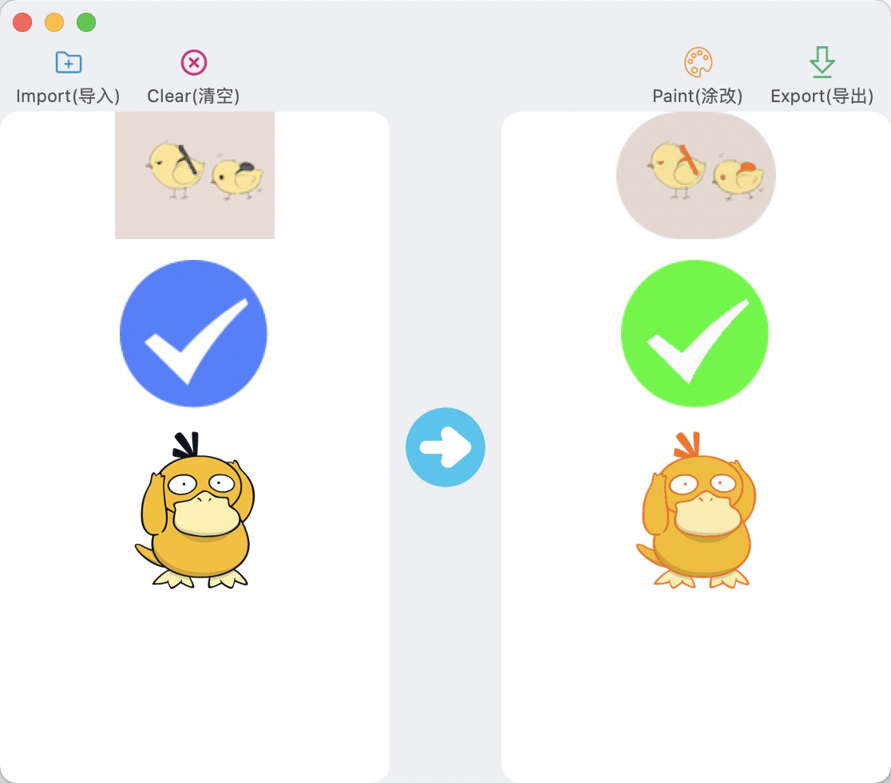
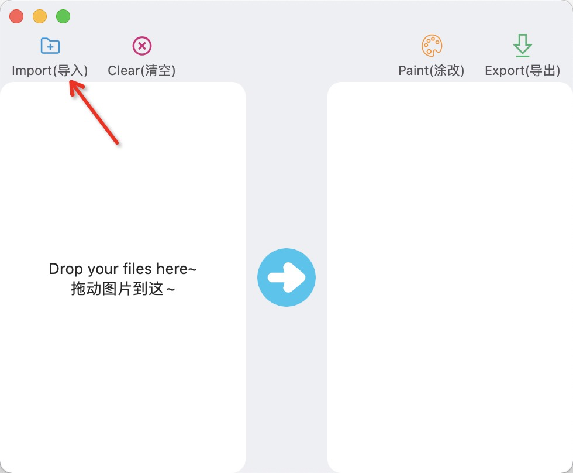
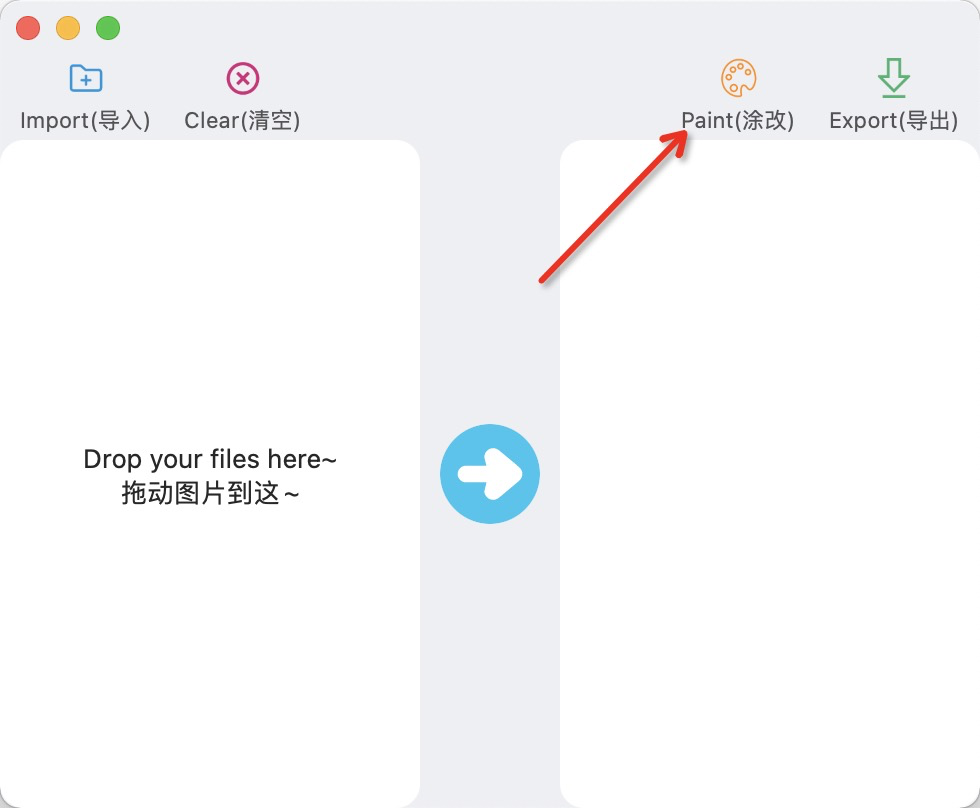
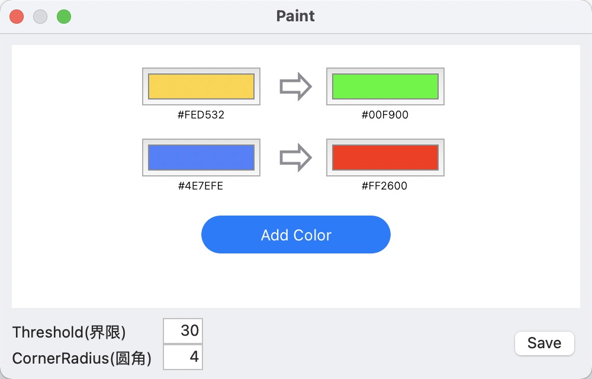
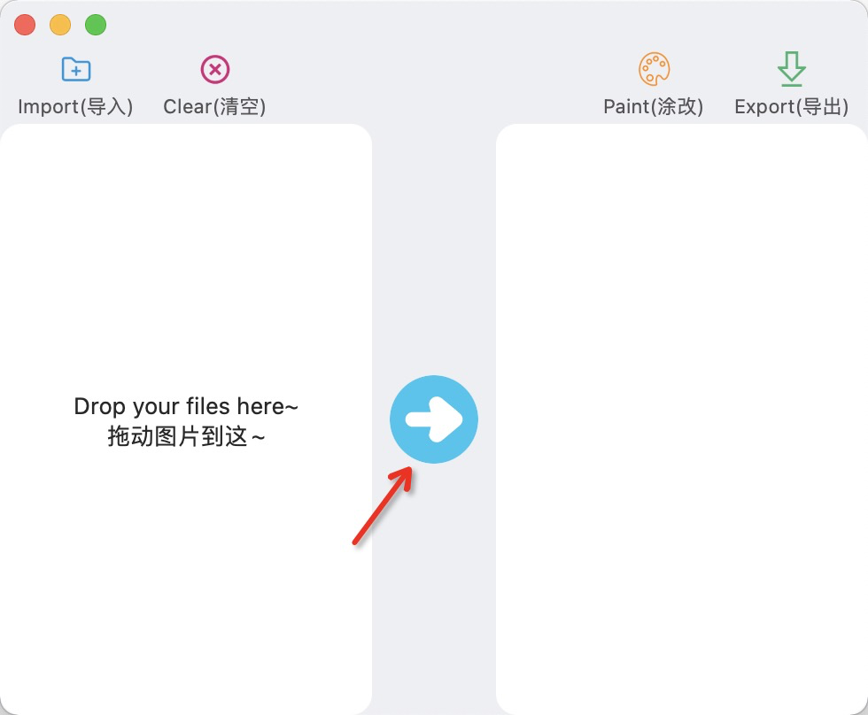
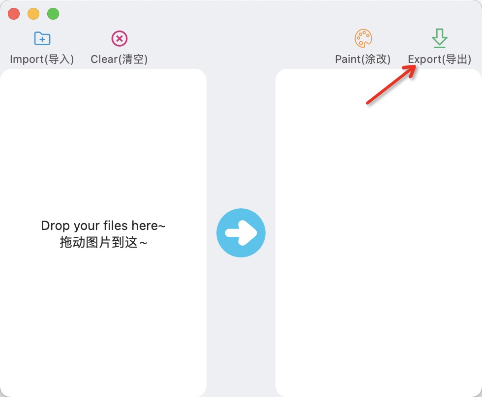

<h1 align="center">
  
   
  ImagePaint
   
</h1>

ImagePaint是一款修改图片颜色、添加圆角的工具。

## 安装

* 你可以下载[dmg文件](https://github.com/moliya/ImagePaint/releases)快捷安装
* 也可以下载源码编译运行

## 使用

#### 1.导入图片

#### 2.设置颜色、界限、圆角

在下图界面中，你可以添加颜色转换规则

> 界限：颜色偏差范围，数值越大，被转换的区域越大

> 圆角：将图片切割出圆角，0为不切割

#### 3.修改

修改操作执行完成后，新的图片就会展示在右侧列表中

#### 4.导出图片

